 

## Table of Contents

1. [Project Summary](#1-project-summary)
2. [Hypothesis](#2-hypothesis)
3. [Data Collection & Cleanup](#3-data-collection--cleanup)
4. [Analysis](#4-analysis)
5. [Postmoterm](#5-postmoterm)
6. [Discussion](#6-discussion)
7. [Contributors](#7-contributors)

**Important:** Out sales data will only analyze the most recent 1,000 transactions limit and not all hostorical transactions. 

## 1. Project Summary
* Our project uncovers patterns in NFT trading for three NFT collections.
    * [Azuki](https://www.azuki.com)
    * [Cryptopunks](http://larvalabs.com/cryptopunks)
    * [Boyed Ape Yatch Club](https://boredapeyachtclub.com/)
* We'll examine relationships between types of:
    * Historical Volume 
    * Purchase prices
    * Trends in sales over the recent 1000 transactions
    * Other transaction data ie. total transaction fees paid for all collections

## 2. Hypothesis
* Should you invest in Azuki, BAYC or Crypto Punks? 
    * What are people paying for NFT in USD value?
    * How much in fees are being paid per transaction?
    * Is the value appreciating or declining?
* How can you tell which collection is performing well?
    * What is the daily transaction volume after Collection is released?

## 3. Data Collection & Cleanup
* How do we collect NFT data?
    - [x] Covalent APIs
    - [x] Etherscan API
    - [x] Other Dependancies ie. Plotly Express
    
* Why cleanup data?
    * Prepare data for analysis
    * Isolate the types of data we are interested in from the rest
    * See what the customer data look like
    * Evaluate performance

## 4. Analysis

* What kind of data we like to work with and the field we're interested in 
    - [x] Daily volume
    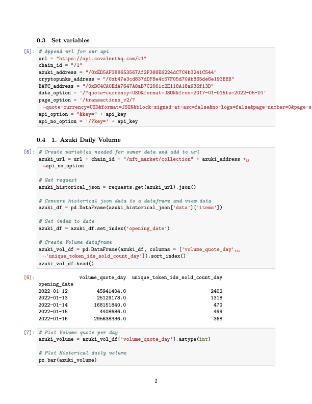
        * Daily Volume Azukis
        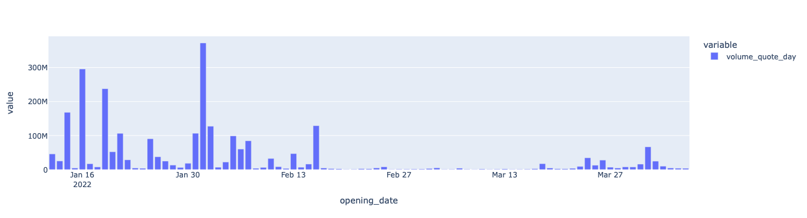
        * Daily Volume Cryptopunks
        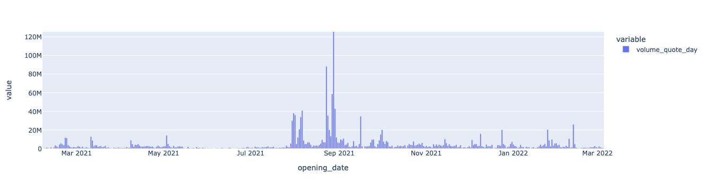
        * Daily Volume Bored Apes
        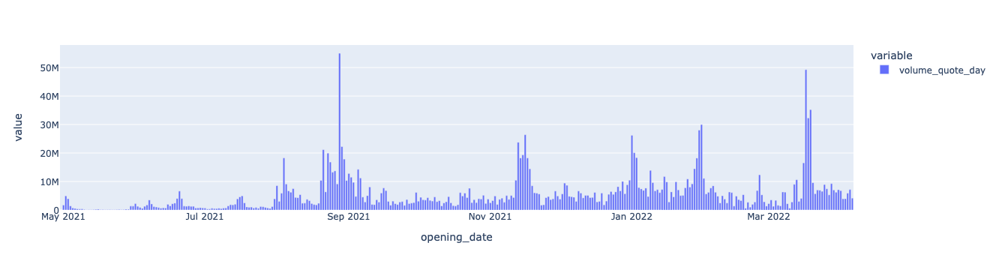
    - [x] Historical sales recent 1000 transactions
    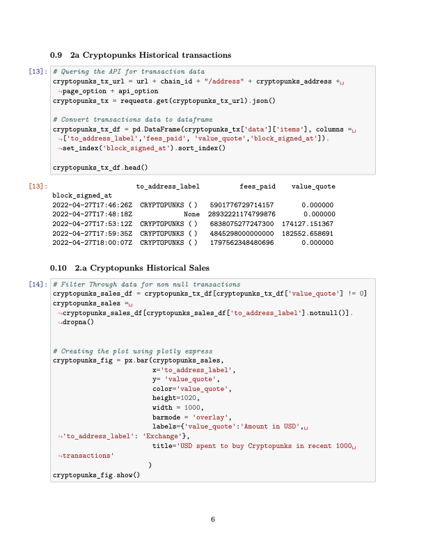
        * Azukis Sales
        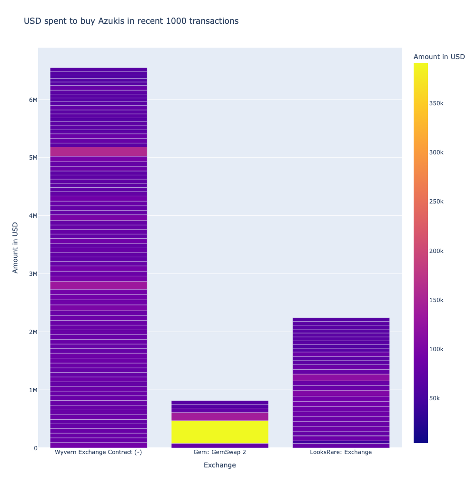
        * Cryptopunks Sales
        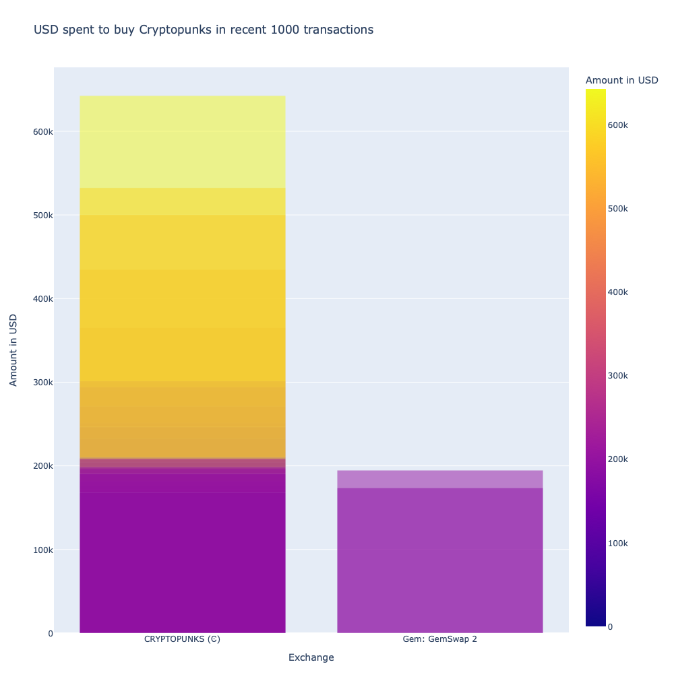
        * Bored Apes Sales
        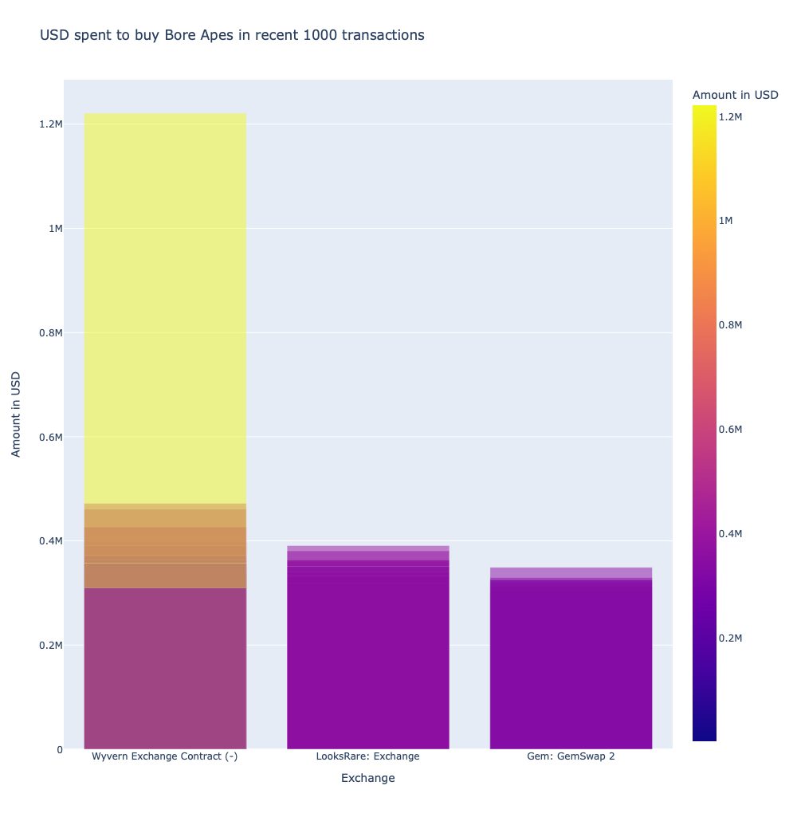
    - [x] Avarage fees paid buying NFTs
    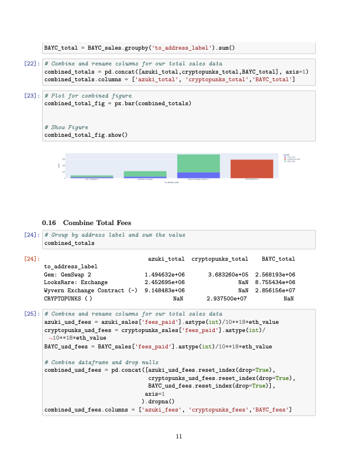
        * Total fees paid comparison
        
    - [x] Comparing Collections performance
        * Total sale volume comparison
        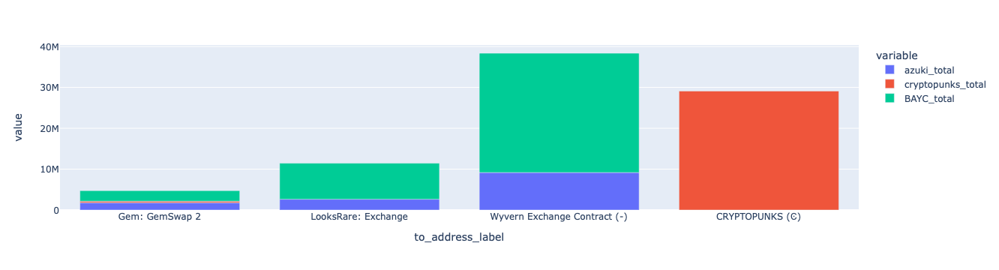

## 5. Postmoterm
* Did we find everything we expected to find?
    - [x] What are our difficulties 
    - [x] How did we deal with them
    - [x] Additional questions that came up
    - [x] What would we research next if we had more time?

## 6. Discussion

* After we've analyzed our data to our satisfaction, we'll put together a presentation to show off our work, explain our process, and discuss our conclusions.
* This presentation will be delivered as a slideshow, and it would give our classmates and instructional staff an overview of our work. 

**File:** [Analysis](./project_analysis.ipynb)  
**File:** [Project Presentation](./group_presentation.pdf)

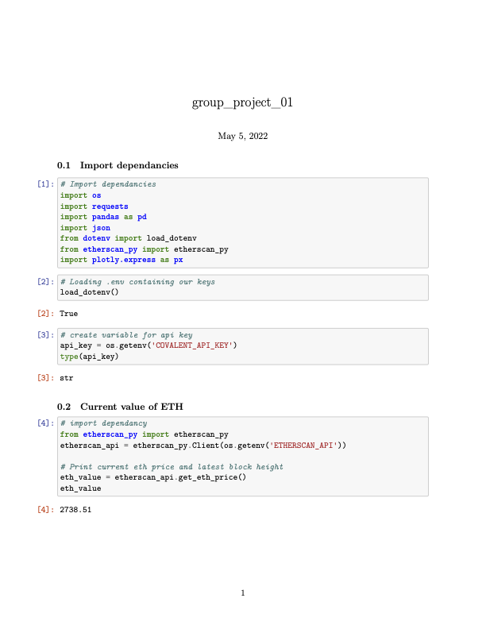
## 7. Contributors 

- [@mmsaki](https://github.com/mmsaki)
- [@dockingbay24](https://github.com/dockingbay24)
- [@angel-estrada7](https://github.com/angel-estrada7)

